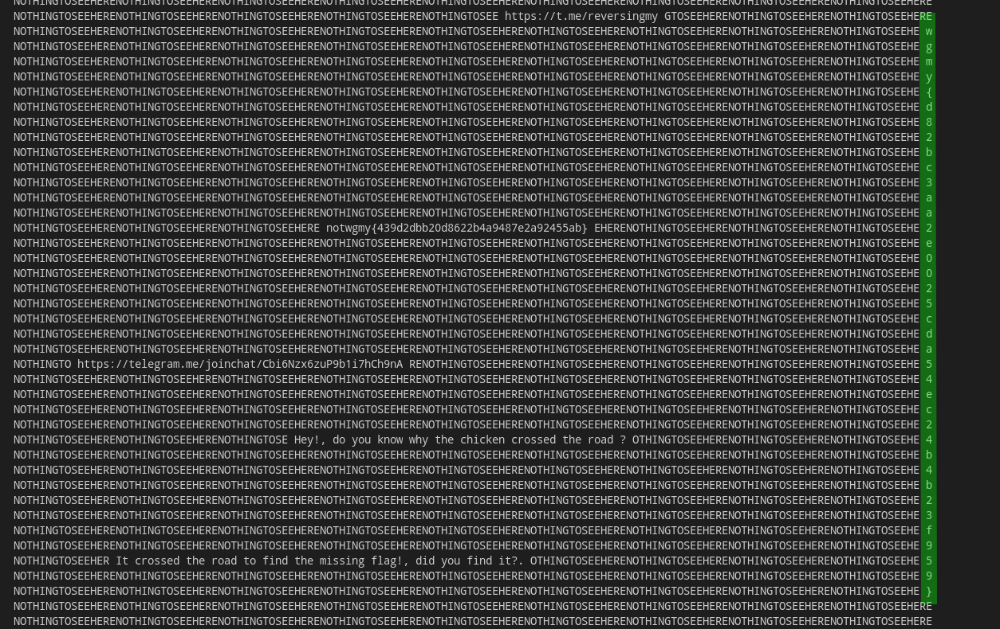

# NothingToSeeHere <!-- omit in toc -->

```
Are you ready to play a game? beware of snakes!.
```

```
$ file ntsh.py 
ntsh.py: UTF-8 Unicode text, with very long lines, with CRLF line terminators
```

- [Introduction](#introduction)
- [Information collection](#information-collection)
- [Solution](#solution)

## Introduction
This is a reverse engineering python challenge.
which contains XOR encryption and random numbered generated from a predefined
seed number.

## Information collection
The thing that catches us when opening the script is the giant base64 string.

looking at the code, it is decoded from base64 and uncompressed using zlib and
the output looks like its compiled python code.

```bash
$ base64 -d base64string > out
$ zlib-flate -uncompress < out > uncompressed
$ file uncompressed
uncompressed: python 3.7 byte-compiled
$ mv uncompressed uncompressed.pyc # to work with uncompyle6
$ uncompyle6 uncompressed.pyc > logic.py    # decompile the pyc file into normal python file
```

we get [logic.py](logic.py) file as an output to that process

looking at the code at logic.py, we see another giant base64 string, this
time when running the code below it we get an array of strings that are
encrypted. which seems like an encrypted map.

we know that the main execution is happening in `ntsh.py`, the only method
called from `ntsh.py` to `logic.py` is `player_move` which updates
the map render based on the location of the player.

In `player_move` it selects part of `game_map` and the corrosponding parts
from `d_keys` and use them in `__decode_view` to decode them by using XOR.

Then `player_move` calls `__update_viewport` to update the view for the
player in the main class when rendering.

As for `d_keys`, it was generated from
```python
def __gen_decode_key(self):
    random.seed(949127234)
    self.d_keys = []
    for r in range(93):
        kr = []
        for k in range(155):
            kr.append(random.randint(33, 126))

        self.d_keys.append(kr)
```

these random `keys` match the map.


## Solution

Now that we have the decoded map object and also the keys to decrypt it, we can decrypt the map manually

```python
keys = gen_decode_key()

for i in range(len(game_map)):
    new_line = ''
    for j in range(len(game_map[0])):
        new_line += chr(ord(game_map[i][j]) ^ keys[i][j])
    game_map[i] = new_line    
```

If the map is printed



we can see the flag at the right side of the map

```
wgmy{d82bc3aa2e0025cda54ec24b4b23f959}
```